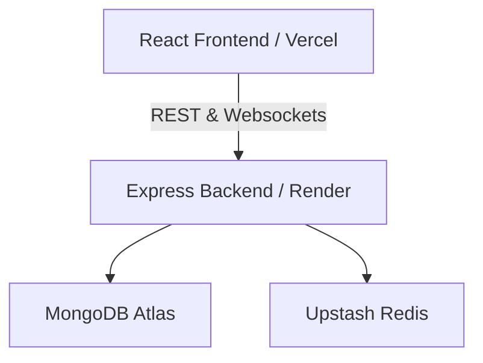

# IntellMeet AI — Real-Time Collaboration & Meeting Intelligence

IntellMeet AI is a premium, enterprise-grade real-time web conferencing and collaboration platform. Built on top of peer-to-peer WebRTC mesh technology and driven by a deterministic NLP intelligence pipeline, it translates live team interactions directly into structured action items, meeting transcripts, and Kanban tasks.

---

## 🚀 Key Features

### 🎙️ Video Conferencing & Screen Sharing
* **Mesh WebRTC Network**: Connects multiple users concurrently with independent media streams.
* **Camera Toggle Safeguard**: Responsive local camera toggle with auto-play rendering, preventing black/frozen screen loops.
* **Screen Sharing**: Live display sharing using `getDisplayMedia()`, swapping RTC video tracks dynamically without dropping the call.
* **Host Control Suite**: Host locks meeting rooms, mutes participants, transfers host status, or removes users from the call.

### 🧠 Deterministic NLP Intelligence Pipeline
* **Auto AI Summary & Transcript**: Triggers automatically when the last participant leaves or disconnects (handles browser closures gracefully).
* **Action Item Extraction**: Scans chat logs using keyword rules (`todo`, `need to`, `fix`, `assign`) to identify responsibilities.
* **Meeting Detail Modal**: View past meeting cards on the dashboard containing full dialogue transcripts, summary paragraphs, and action items.

### 📋 Kanban Project Workspace
* **Sync Action Items to Tasks**: Instantly convert meeting action items to project board tasks with custom priority, description, and assignees.
* **Interactive Columns**: Organize tasks under **To Do**, **In Progress**, and **Completed** with status transitions.
* **Mentions & Alert System**: Real-time notification bell dropdown in the navbar alerting team members of task assignments.

---

## 🛠️ Tech Stack

| Component | Technology | Description |
| :--- | :--- | :--- |
| **Frontend** | React (Vite) | High-performance client build engine |
| **Styling** | Tailwind CSS (v4) | Elegant, slate-dark premium user interface |
| **Backend** | Node.js / Express | Robust, event-driven REST API server |
| **Real-time Sync** | Socket.io | Bidirectional WebSockets for room sync & signaling |
| **Database** | MongoDB / Mongoose | Scalable storage for users, chats, meetings, & tasks |
| **Caching** | Redis | High-speed cache for meeting details |

---

## 📂 Project Structure

```text
intellmeet/
├── backend/                     # Node.js + Express + Socket.io Server
│   ├── src/
│   │   ├── config/              # DB & Redis connection setups
│   │   ├── controllers/         # REST Controllers (Auth, Task, Meeting, Notif)
│   │   ├── middleware/          # JWT protection & uploads
│   │   ├── models/              # Mongoose schemas (User, Meeting, Task, Notif)
│   │   ├── routes/              # Express API Route mounts
│   │   ├── sockets/             # Socket.io handlers (meetingSocket, chatSocket)
│   │   └── app.js               # Express application initialization
│   └── server.js                # Server startup entry point
│
├── frontend-main/               # React + Tailwind CSS client
│   ├── src/
│   │   ├── components/
│   │   │   └── meeting/         # Meeting elements (ChatSidebar, controls)
│   │   ├── services/            # Axios API wrappers (api.js) & Socket instances
│   │   ├── socket/              # Isolated WebRTC signaling socket setup
│   │   ├── Auth.jsx             # Password masked login portal
│   │   ├── Dashboard.jsx        # AI analytics & metric overview cards
│   │   ├── MeetingRoom.jsx      # Live WebRTC room & controls
│   │   └── ProjectBoard.jsx     # Kanban task board
│   └── vite.config.js           # Client bundler configuration
└── .gitignore                   # Monorepo glob patterns list
```

---

## ⚙️ Installation & Local Setup

### Prerequisites
* **Node.js** (v18+)
* **MongoDB** (Local instance or Atlas URL)
* **Redis** (Optional: Caching will gracefully disable if offline)

### 1. Backend Configuration
1. Navigate to the backend directory:
   ```bash
   cd backend
   ```
2. Install dependencies:
   ```bash
   npm install
   ```
3. Create a `.env` file in the root of the `backend/` directory:
   ```env
   PORT=5000
   MONGO_URI=mongodb://127.0.0.1:27017/intellmeet
   JWT_SECRET=your_jwt_signing_key_here
   NODE_ENV=development
   REDIS_URL=redis://127.0.0.1:6379
   ```
4. Start the backend development server:
   ```bash
   npm run dev
   ```

### 2. Frontend Configuration
1. Navigate to the frontend directory:
   ```bash
   cd ../frontend-main
   ```
2. Install dependencies:
   ```bash
   npm install
   ```
3. Start the frontend development server:
   ```bash
   npm run dev
   ```
   Open `http://localhost:5173` in your browser.

---

## 🚀 Production Deployment

### Deploys at a Glance


### 1. Stateful Backend (Render/Railway)
WebSockets require a persistent stateful server. Deploy the `backend/` folder to a service like Render:
* **Root Directory**: `backend`
* **Build Command**: `npm install`
* **Start Command**: `node server.js`
* **Env Variables**: Add your production `MONGO_URI`, `JWT_SECRET`, and `REDIS_URL`.

### 2. Stateless Frontend (Vercel)
Deploy the `frontend-main/` folder to Vercel:
* **Root Directory**: `frontend-main`
* **Build Command**: `npm run build`
* **Output Directory**: `dist`
* **Env Variables**:
  * `VITE_API_URL`: `https://your-backend-url.onrender.com/api`
  * `VITE_SOCKET_URL`: `https://your-backend-url.onrender.com`

---

## 📜 License
This project is licensed under the MIT License.
